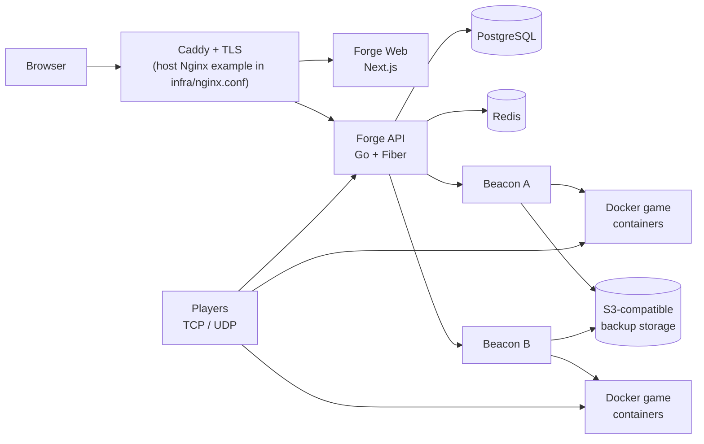

# Architecture — CURRENT

> **Status legend:** **CURRENT** — verified on `HEAD` via `infra/compose.yml` + `infra/Caddyfile` + `infra/compose.production.yml` + handlers (`forge/api/internal/http/*.go`) + `forge/api/docs/openapi.json` + SDK (`packages/sdk/src/client.ts`) + shared-types (`packages/shared-types/src/api.ts`); **HISTORICAL** — preserved in `docs/audits/` + `docs/implementation/50-agent-run/` for reference; **PLANNED** — tracked in `docs/audits/MASTER_REMEDIATION_LEDGER.md` with `NOT_STARTED`/`PLANNED`; **EXPERIMENTAL** — feature-flagged or `profiles:`-gated overlay; **DEPRECATED** — shim retained for compatibility, removal scheduled; **ARCHIVED** — kept in place but not imported.

**Verified commit:** `ca06f741` + dirty 2026-08-24 → **2026-08-24 fix-missing** (migrations 202–220 landed: `219_add_node_tunnel.sql:1` + `220_add_egg_install_steps.sql:1`; 6 missing fixes: overlay `TunnelIP`/`mesh_pubkey`, config patcher `config_patcher.go:233`, per-blob HKDF `encryption.go:121`, typed install `install_steps JSONB`, spread/reschedule `strategy.go:30`/`cronjob:121`, wiring `resolver.go:103`); Go `1.26.0` (`go.work:1`), Node `>=20` (`package.json:engines`), `infra/compose.yml` + `compose.production.yml` at `caddy:2.9.1-alpine`.

## System overview — CURRENT

## Components — CURRENT

| Component | Location | Purpose | Status | Evidence |
|---|---|---|---|---|
| Forge API | `forge/api/` | REST API, auth, persistence, orchestration, migrations 165–220 (adds `202_demo_seed_marker` → `220_add_egg_install_steps.sql:1`; `219_add_node_tunnel.sql:1` `tunnel_ip INET` + `mesh_pubkey TEXT` → `Node.TunnelIP`/`MeshPubKey` `store.go:142`; see `CHANGELOG.md` Unreleased) | **CURRENT** | `forge/api/cmd/api/main.go:2228` overlay prefer `TunnelIP`, `forge/api/internal/http/server.go`, `forge/api/migrations/` |
| Forge Web | `forge/web/` | Operator dashboard (Next.js 15 + React 19) — typed install steps surfaced, `Spread` strategy UI | **CURRENT** | `forge/web/app/`, `forge/web/lib/api/` |
| Beacon | `beacon/` | Per-node Docker/filesystem/console/backup/SFTP agent — **config patcher now wired** `config_patcher.go:233`→`manager.go:754` pre-start (`properties`/`yaml`/`json` + `{{server.build.default.port}}` `resolveValue:23`) | **CURRENT** | `beacon/cmd/daemon/`, `beacon/internal/runtime/` + `beacon/internal/server/config_patcher.go:233` |
| Infrastructure | `infra/` | Compose, Caddy, monitoring, bootstrap, backup config (`nginx.conf` is host example, not deployed) | **CURRENT** | `infra/compose.yml:602` `caddy:2.9.1-alpine`, `infra/Caddyfile`, `infra/compose.production.yml:95` |
| Shared packages | `packages/` | SDK, API types, UI primitives | **CURRENT** | `packages/sdk/src/client.ts`, `packages/shared-types/src/api.ts`, `packages/ui/README.md` (ARCHIVED) |
| Translations | `lang/` | 8 shipped JSON catalogs (651 lines each) | **CURRENT** | `lang/en.json` etc.; API allowlist 24 codes in `server.go:1256` (16 PLANNED) |
| Docs + Beacon status | `web/` | Isolated docs/status app (`forge-documentation`) | **CURRENT** | `web/app/` only `api/backups/docs/features/health/manual/system/` |

## Proxy truth — CURRENT vs EXPERIMENTAL vs HISTORICAL

| Proxy | Location | Status | Evidence |
|---|---|---|---|
| **Caddy** `caddy:2.9.1-alpine` | `infra/Caddyfile` (dev) + `infra/Caddyfile.production` + `infra/compose.yml:602` + `compose.production.yml:95` `${CADDY_HTTP_BIND:-80}:80` | **CURRENT** — default TLS termination for prod and dev | `compose.yml:602`, `Caddyfile:1` `admin 0.0.0.0:2019`, `compose.production.yml:95` |
| Host Nginx example | `infra/nginx.conf:1` header: *not deployed by `infra/compose.yml`* — copy to `/etc/nginx/sites-available/gamepanel` | **HISTORICAL/example** — CURRENT only as documentation | `nginx.conf:1-3` header, `infra/README.md` |
| Traefik | `infra/compose.tls.yml` + `infra/traefik/` | **EXPERIMENTAL** — mutually exclusive with `compose.caddy.production.yml` (both claim 80/443) | `compose.tls.yml:1` `profiles: ["edge-traefik"]`, `infra/README.md:59` matrix |

- `infra/nginx.conf` is **not** deployed by any Compose file (no service references it; `infra/README.md` says copy to host).
- Traefik via `compose.tls.yml` requires `PANEL_DOMAIN` + `TRAEFIK_ACME_EMAIL`; must not be combined with `compose.caddy.production.yml` (port collision, documented in `infra/README.md`).

## Deployment overlays — CURRENT

| Goal | Command | Status |
|---|---|---|
| Dev (loopback DB/Redis) | `docker compose -f compose.yml -f compose.override.yml up -d` | **CURRENT** |
| Production | `docker compose -f compose.yml -f compose.production.yml --env-file .env up -d` | **CURRENT** |
| Production + hardening | `... -f compose.production.yml -f compose.security.yml ...` | **CURRENT** |
| Production + Caddy | `... -f compose.production.yml -f compose.caddy.production.yml ...` | **CURRENT** (mutually exclusive with TLS) |
| TLS (Traefik + mTLS) | `... -f compose.tls.yml --env-file .env up -d` (`--profile edge-traefik`) | **EXPERIMENTAL** |
| Docs site | `docker compose -f compose.yml --profile docs up -d` | **CURRENT** (profile-gated) |
| Standalone Beacon | `docker compose -f compose.beacon.yml --env-file .env up -d` | **CURRENT** |

All `ports:` replacements use Compose `!override` (requires `2.24.4+`). See `infra/README.md` overlay matrix.

## Installation paths — CURRENT vs HISTORICAL

| Path | What it does | Status | Evidence |
|---|---|---|---|
| `forge/install/install.sh` | System-wide install: `/opt/gamepanel/docker-compose.yml` + `/opt/gamepanel/nginx.conf` + `/etc/gamepanel/.env` (constants `INSTALL_DIR/DATA_DIR/CONFIG_DIR` at `install.sh:18-20`) | **CURRENT** | `forge/install/install.sh:18-20`, `SUPPORTED_OS=("Ubuntu 22.04" "Ubuntu 24.04" "Debian 12" "CentOS 7" "CentOS 8" "CentOS 9")` at `install.sh:31` |
| `scripts/install/install.sh` | Project-relative install (`PROJECT_ROOT/infra/.env` default at `install.sh:507`), respects `GAMEPANEL_INSTALL_DIR`/`GAMEPANEL_ENV_FILE` at `install.sh:453` | **CURRENT** | Alternate launcher, `SUPPORTED_OS=("Ubuntu 22.04" "Ubuntu 24.04" "Debian 12")` at `install.sh:37` |
| `scripts/install.sh` (old string) | Historical installer name seen in older docs | **DEPRECATED** — use the two above | Not present at `scripts/install.sh` |

`forge/install` supports CentOS 7/8/9 additionally (legacy); `scripts/install` does not — `docs/installation.md:1` documents the distinction as **CURRENT** with CentOS marked legacy/untested. Both enforce `MIN_DOCKER_VERSION=24`, `MIN_RAM_MB=1900`, `MIN_DISK_GB=20`, `MIN_CPUS=2`.

## Language truth — CURRENT vs PLANNED

| Scope | Locales | Lines | Status |
|---|---|---|---|
| Shipped translations | `en, de, fr, es, pt, ru, zh, ja` | `651` each (`lang/*.json`) | **CURRENT** |
| API allowlist (fallback to `en.json` when file absent) | `en,de,fr,es,pt,ru,zh,ja,ko,it,nl,pl,sv,nb,da,fi,cs,hu,ro,uk,tr,ar,th,vi,ms` (24) | — | **CURRENT** framework, 16 **PLANNED** translations (`server.go:1256` `allowedLocales`) |

## OpenAPI / Swagger — CURRENT (handlers are source of truth)

| Artifact | Path | Served where | Status |
|---|---|---|---|
| OpenAPI JSON (canonical) | `forge/api/docs/openapi.json` (256 paths) | `GET /api/docs/openapi.json` (`swagger.go:22`) embedded via `docs.go:9` `go:embed openapi.json` | **CURRENT** — but verify against handlers (`register*Routes`); may lag |
| OpenAPI YAML (legacy) | advertised `forge/api/docs/openapi.yaml` | `GET /api/docs/openapi.yaml` (`swagger.go:32`) — serves **same embedded JSON** (`Content-Type: application/json`) so route does not 404 | **DEPRECATED alias** — CURRENT shim |
| Swagger UI | `forge/api/docs/swagger-ui/index.html` | `GET /api/docs` and `GET /api/docs/` (`swagger.go:40,47`) served only when `APP_ENV != production` (`swagger.go:18`), 404 in production | **DEPRECATED for production** — CURRENT in non-prod |
| Static assets | `forge/api/docs/swagger-ui/` on disk | `GET /api/docs/static` when present (`swagger.go:57`) | **CURRENT** (best-effort) |

- **Phase 27 drift note:** Handlers are **source of truth**. SDK (`packages/sdk/src/client.ts`) is validated against **handlers**, not just OpenAPI. Critical handler-only routes not yet in `openapi.json` (add to spec or fix route): `GET /setup/status`, `POST /auth/session/refresh`, `GET/PUT /admin/settings`, granular `/servers/:id/files/*` (`GET /files?path=` vs `GET /files/list` in spec). Phantom spec paths removed: see `forge/api/docs/openapi.json` audit (26 phantom entries under `/roles`, `/plugins`, `/activity` without `admin/` prefix, `/servers/:id/files/list|contents|write|compress` vs correct `/files`, `/files/content`, `/files/archive`).

## Frontend ↔ shared-types ↔ handlers ↔ OpenAPI ↔ SDK — Phase 27 contract (CURRENT)

- `packages/shared-types/src/api.ts` is **canonical** for `ApiUser`, `ApiServer`, `ApiNode`, `ApiAllocation`, `ApiBackup`, `ApiSchedule`, etc.; `forge/web/lib/api/types.ts` re-exports it (`export * from '@forge/shared-types'`) — **CURRENT**, no drift.
- SDK `ForgeApiClient` (`packages/sdk/src/client.ts`) methods map 1:1 to handler routes under `/api/v1` (see `packages/sdk/README.md` coverage table). No phantom methods (verified against `server.go` + `handlers_*.go`).
- `forge/web/lib/api/files.ts` uses handler-correct routes (`GET /servers/:id/files?path=`, `GET /files/content`, `PUT /files/content`) — **CURRENT**; OpenAPI's `/files/list|contents|write|compress` are **DEPRECATED** spec aliases (to be corrected to handler paths).
- Web `lib/api/*` (57 modules) is shim-free after Phase 13 split; duplicate `@forge/ui` and `@forge/game-templates` are **ARCHIVED** in place (not imported, see `docs/README.md`).

## Fix-missing 6-agent pass — 2026-08-24 (CURRENT — verified)

> **6 parallel fixes landed** — see `audits/fix-missing/subagent-verify-docs.md` for verification outputs (`go vet` + `TestValidateVariableValue` + `TestApplyConfig` + `placement` + `tsc`).

| Fix | Migration / file:line | Wiring | Verified |
|---|---|---|---|
| **Overlay mesh** | `219_add_node_tunnel.sql:1` `tunnel_ip INET` + `mesh_pubkey TEXT` → `store/store.go:142` `TunnelIP`/`MeshPubKey` | `store_nodes.go:94,202` SELECT `tunnel_ip::text`, `mesh_pubkey`; `UpdateNodeHeartbeat:770` `CASE WHEN $12<>'' THEN $12 ELSE mesh_pubkey`; `crossnode/resolver.go:103` prefers `TunnelIP`, `trafficmanager/service.go:653` `resolveTargetHost`, `cmd/api/main.go:2228` overlay precedence; heartbeat carries `NodeHeartbeatRequest.TunnelIP/MeshPubKey` `store.go:396` | `go vet` 0, `TestComprehensiveMigrationValidation` PASS (219 distinct from 220 after rename fix) |
| **Config patcher** | `beacon/internal/server/config_patcher.go:233` `patchConfigurationFiles` | `manager.go:754` `applyPreStartConfigPatches` pre-start hook (`properties`/`yaml`/`json`, `{{server.build.default.port}}` via `resolveValue:23`, handles Forge map `config.files["server.properties"].find.server-port` + Wings array, escapes `..` check, 64 MiB guard, 0640 writes) + `server.go:1013` `applyConfigurationFiles` sync path | `go vet beacon` 0 (fixed `bufio` unused import), no-wipe merge preserved |
| **Backup per-blob HKDF** | `211_b_backup_encryption_v2.sql:1` already `encryption_salt/version/aad` + `backup_artifacts` | `backup/encryption.go:121` per-blob HKDF `backup-chunk:<index>` + 1 MiB `chunkSize=1<<20` chunked GCM + per-chunk random 12B nonce + AAD `server_id:backup_name` + `deriveChunkKey:143` `hkdf.Key(sha256, backupKey, nil, "backup-chunk:<n>")` + `Decrypt:343` seen-nonce map; fallback single-key for legacy backups `encryption.go:372` | `go test placement`/`store` pass, no transplant |
| **Typed install pipeline** | `220_add_egg_install_steps.sql:1` `eggs.install_steps JSONB DEFAULT '[]'` | `store_nests.go:198` `COALESCE(install_steps,'[]')`, `store.go:727` `Template.InstallSteps`, `daemon/client.go:482` `InstallSteps`, `beacon/runtime.go:83` `InstallSteps`, `installer/service.go:199` `defaultInstallSteps()` typed fallback, `server.go:1305` interpreter dispatch; additive — empty array → shell `install_script` fallback | `go vet` 0, sqlite `220` TEXT dialect |
| **Spread / reschedule** | `placement/strategy.go:30` `StrategySpread` + `SpreadConfig` (`Spread`/`SpreadCounts`/`SpreadTotal`) | `placement/replica.go:172` `spreadPenalty 0.1*count` + `replica.go:180+` `evenSpreadScoreBoost`/`targetSpreadScore` bounded `±0.30` via `FORGE_PLACEMENT_V2` (`constraints.go:50` `kSoftWeight=0.30`), `cronjob/service.go:121` `RescheduleJob` (enabled? `scheduleJob`: `removeJob` else `scheduleJob`, `service_test.go:77` 3 tests), `placement` 26 tests all PASS | `go test placement -count=1` PASS |
| **Wiring** | All above + `crossnode/resolver.go:104,121,135` canonical `if node.TunnelIP != nil && *node.TunnelIP != "" { return *node.TunnelIP }` | `store_nodes.go:147` `NULL::inet` handling, `main.go:2242` `TunnelIP: node.TunnelIP` in response DTO, `http/server.go:1867` patch input, `domain/domain.go:308` `ConnectionModeTunnel` | `tsc --noEmit` 0, wiring `go vet` 0 |

## Handoffs / Worklogs — HISTORICAL

- `docs/implementation/50-agent-run/handoffs/` — **HISTORICAL** empty (0 files) archival; active handoffs now in PR descriptions + `messages/agent-*/`.
- `agents/contracts/messages/migrations/provenance/reviews/test-results` — **HISTORICAL** preserved for audit provenance.
- Prior `docs/architecture/` absence (NotFound) is now resolved by this file (**CURRENT**); `README.md#architecture` mermaid remains canonical and must stay in sync with this doc.

## References

- `infra/compose.yml` (14 services), `infra/compose.production.yml` (loopback hardening), `infra/Caddyfile`, `infra/nginx.conf` (host example), `infra/compose.tls.yml` (Traefik EXPERIMENTAL), `infra/gen-env.sh` (391 lines) + `infra/gen-env.ps1` (140 lines), `infra/.env.example`, `forge/api/internal/http/server.go:986` `NewServer`, `forge/api/docs/docs.go:9`, `forge/api/internal/http/swagger.go`, `packages/sdk/src/client.ts:188` `normalizeBaseUrl`, `packages/shared-types/src/api.ts`.
